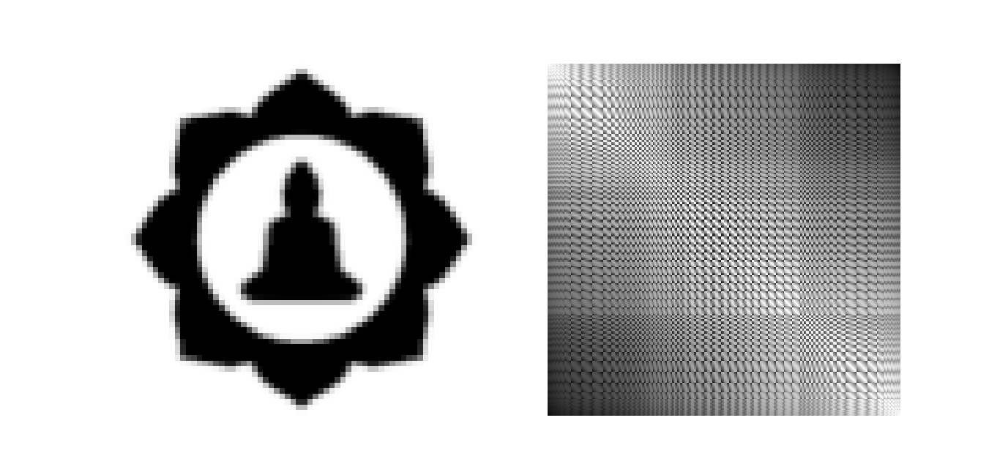
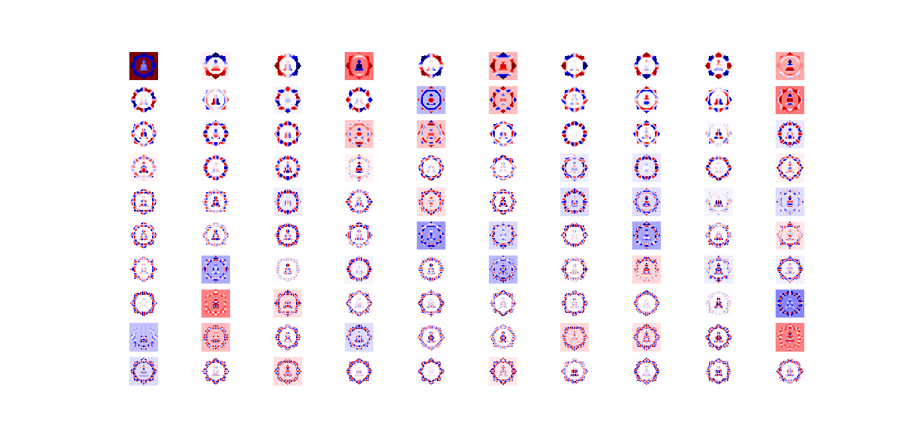
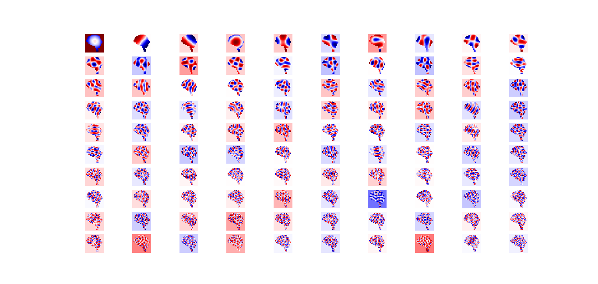
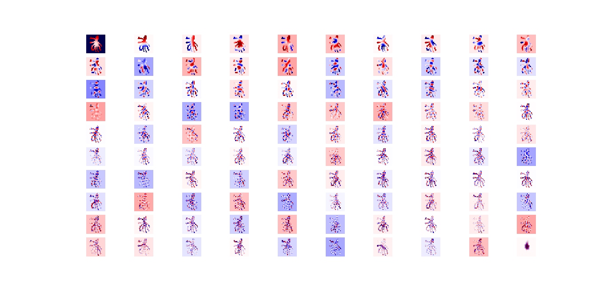

# binary_laplacian_eigenvectors
Laplacian Eigenvector (eigenfunctions) of binary images.

I construct a Kernel Matrix over 0-valued (or 1-valued) pixels, using the euclidean norm. And using a sparse version of eig (which is already implemented in scipy), we find N eigenvectors.
Then I place the values into their corresponding places.

Here's some using the Caltech101 Silhouette dataset.

